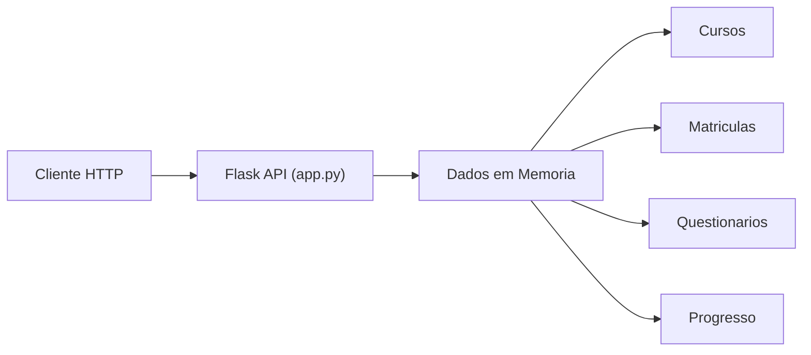
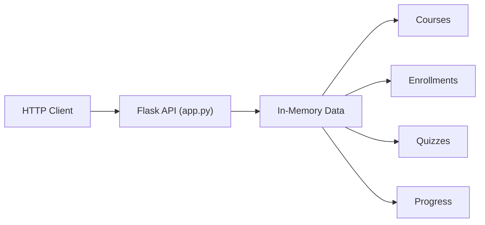

# Digital Learning Platform

[](https://www.python.org/)
[](https://flask.palletsprojects.com/)
[](LICENSE)

[Portugues](#portugues) | [English](#english)

---

## Portugues

### Visao Geral

API REST para uma plataforma de aprendizado digital, construida com Flask e Python. O servidor (`app.py`, ~340 linhas) utiliza armazenamento em memoria e expoe endpoints para gerenciamento de cursos, matriculas, progresso e questionarios.

### Funcionalidades

- **Cursos**: CRUD de cursos com filtragem por categoria, nivel e busca textual
- **Matriculas**: Inscricao de alunos em cursos com verificacao de duplicatas
- **Progresso**: Acompanhamento de progresso por modulo com calculo automatico de porcentagem
- **Questionarios**: Submissao de respostas com calculo automatico de nota
- **Dashboard**: Estatisticas de matriculas e atividade recente por aluno
- **Categorias**: Listagem de categorias com contagem de cursos e media de avaliacoes

### Arquitetura



### Como Executar

```bash
git clone https://github.com/galafis/Digital-Learning-Platform.git
cd Digital-Learning-Platform
pip install -r requirements.txt
python app.py
```

O servidor inicia em `http://0.0.0.0:5000`.

### Endpoints

| Metodo | Rota | Descricao |
|--------|------|-----------|
| GET | `/api/courses` | Listar cursos (filtros: category, level, search) |
| GET | `/api/courses/<id>` | Obter curso por ID |
| POST | `/api/enroll` | Matricular aluno |
| GET | `/api/progress` | Consultar progresso |
| POST | `/api/progress` | Registrar progresso |
| GET | `/api/quizzes/<id>` | Obter questionario |
| POST | `/api/quizzes/<id>/submit` | Submeter respostas |
| GET | `/api/dashboard/<student_id>` | Dashboard do aluno |
| GET | `/api/categories` | Listar categorias |

### Testes

```bash
pip install -r requirements.txt
pytest tests/
```

---

## English

### Overview

REST API for a digital learning platform, built with Flask and Python. The server (`app.py`, ~340 lines) uses in-memory storage and exposes endpoints for course management, enrollments, progress tracking, and quizzes.

### Features

- **Courses**: CRUD with filtering by category, level, and text search
- **Enrollments**: Student enrollment with duplicate checking
- **Progress**: Per-module progress tracking with automatic percentage calculation
- **Quizzes**: Answer submission with automatic scoring
- **Dashboard**: Enrollment statistics and recent activity per student
- **Categories**: Category listing with course counts and average ratings

### Architecture



### How to Run

```bash
git clone https://github.com/galafis/Digital-Learning-Platform.git
cd Digital-Learning-Platform
pip install -r requirements.txt
python app.py
```

The server starts at `http://0.0.0.0:5000`.

### Endpoints

| Method | Route | Description |
|--------|-------|-------------|
| GET | `/api/courses` | List courses (filters: category, level, search) |
| GET | `/api/courses/<id>` | Get course by ID |
| POST | `/api/enroll` | Enroll student |
| GET | `/api/progress` | Query progress |
| POST | `/api/progress` | Record progress |
| GET | `/api/quizzes/<id>` | Get quiz |
| POST | `/api/quizzes/<id>/submit` | Submit answers |
| GET | `/api/dashboard/<student_id>` | Student dashboard |
| GET | `/api/categories` | List categories |

### Tests

```bash
pip install -r requirements.txt
pytest tests/
```

### Project Structure

```
Digital-Learning-Platform/
├── app.py              # Flask API server
├── templates/
│   └── index.html      # Dashboard page
├── tests/
│   ├── __init__.py
│   └── test_app.py     # API tests (pytest)
├── requirements.txt    # Python dependencies
├── LICENSE
└── README.md
```

### Author

**Gabriel Demetrios Lafis**
- GitHub: [@galafis](https://github.com/galafis)
- LinkedIn: [Gabriel Demetrios Lafis](https://linkedin.com/in/gabriel-demetrios-lafis)

### License

This project is licensed under the MIT License - see the [LICENSE](LICENSE) file for details.
